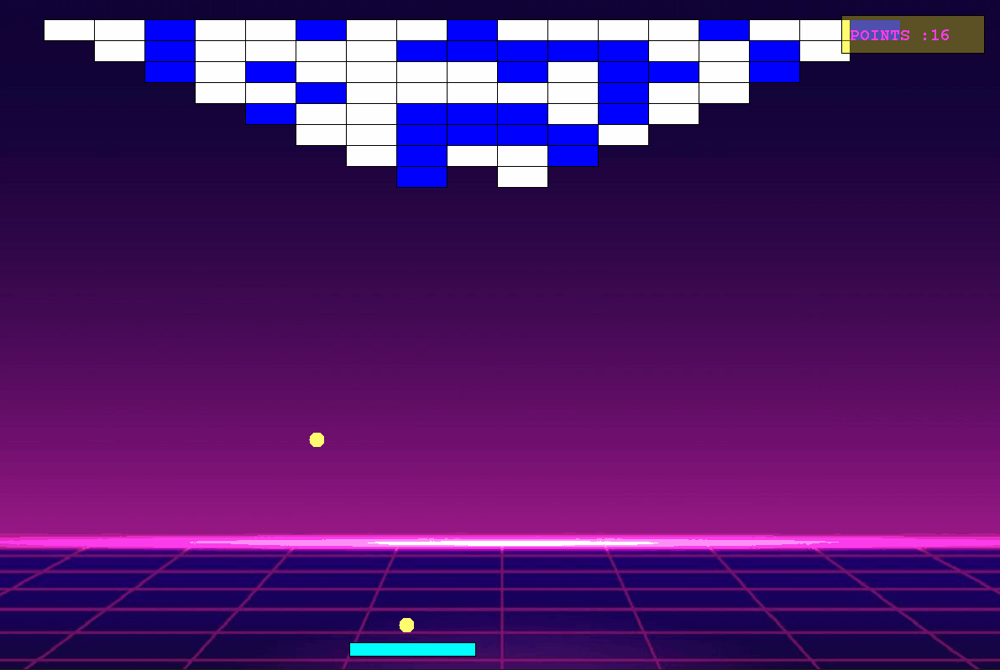
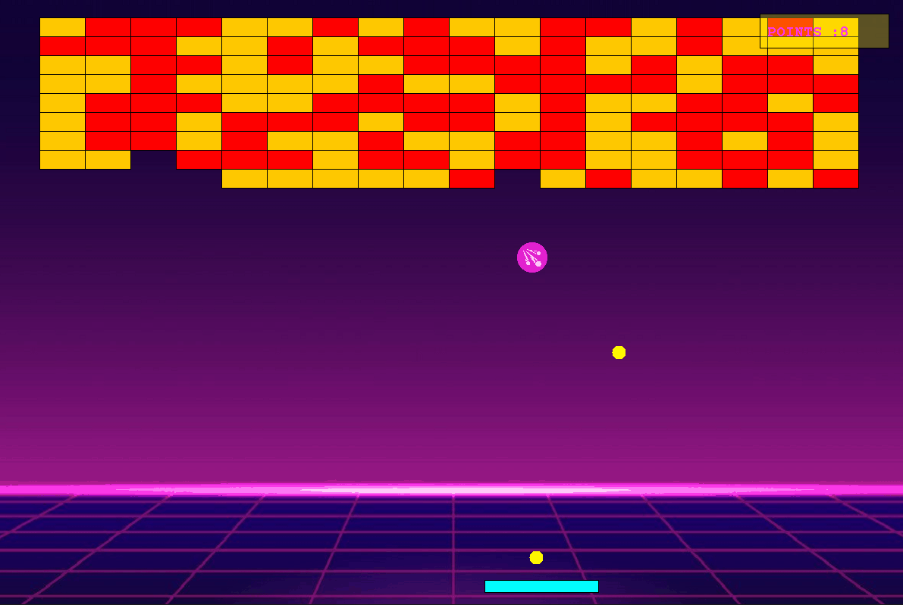

        
# Brick-Breaker
A Simple game in which we have to smash a wall of bricks by deflecting a bouncing ball with a paddle. The paddle is moving horizontal and its controlled by mouse or by keyboard arrows.  

## Table of contents
* [General info](#general-info)
* [Inspiration](#inspiration)
* [Screenshots](#screenshots)
* [Technologies](#technologies)
* [Setup](#setup)
* [Features](#features)
* [Status](#status)
* [Contact](#contact)

## General info
I wanted to create my first game which be very similar to the game I played in my childhood. I wanted to actually do whole graphic and make it „alive”.

## Inspiration
My inspiration was the old game which I played when I was 10 years old.


 https://www.c64-wiki.com/wiki/Batty 
                                                                       

## Screenshots

<br>



## Technologies

Used Libraries: 

* java.io.*
* javax.swing.*
* java.awt.*;
* java.awt.event.*;
* java.util.*;
* java.imageio.*;

## Setup

Installation would require the following components and configurations:

* Github
* Latest version of Java

After these are all set up, you can follow the next few instructions to get a copy of the application on your computer and test run the program:

1. Download the whole repo
2. Change the directory with the `cd` command into the *BrickBreaker* folder that is in the folder where the repo had been clone to
3. Run the program with `java -jar target/odbijanie.jar`

## Code Examples

```
private void chooseKeyboardOrMouse(int keyBoardSpeed, int mouseSpeed) {
        if (keyBoardSpeed > mouseSpeed) {
            speedX = keyBoardController.getHorizontalMovement();
        } else if (mouseSpeed > keyBoardSpeed) {
            speedX = -mouseController.getHorizontalMovement();
        }else {
            speedX = 0;
        }
    }
```
```
public BrickSolid(int x, int y, Mediator mediator) {
        super(x, y,Color.GRAY, mediator);
        counter = 0;
    }
    @Override
    public void reactToHit(GameObject object) {
        if (counter >= 1) {
            SoundEffect.BRICK_BREAKER.play();
            brickDestroyed();
        }
        setColor(Color.BLUE);
        counter++;
    }
```
## Features

Features: 
* Add New Levels (more complicated)
* Add Few More Specials ( a shooter one )

TODO:
* Change ball speed to check collision with paddle
* Check out switching levels 

## Status
Project is still in progress cause it gives me a lot of fun 

## Contact
Created by [@malgorzatakowalska](https://www.malgorzatakowalska.com/) - feel free to contact me! 

